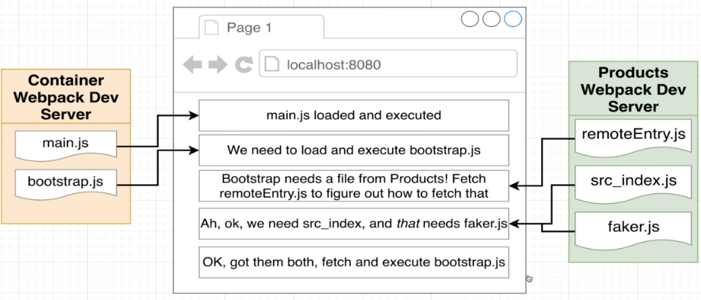
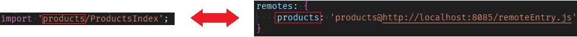
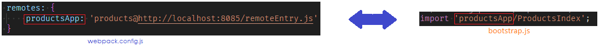
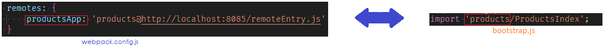
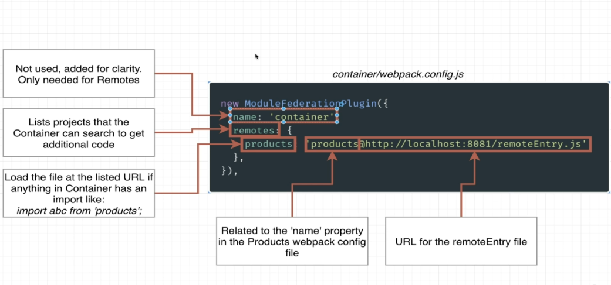
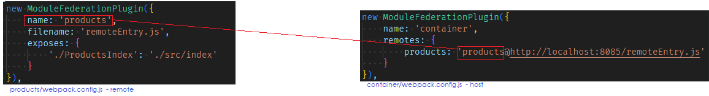
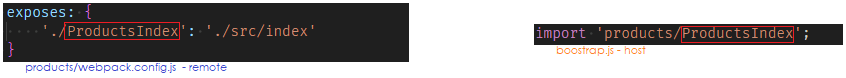
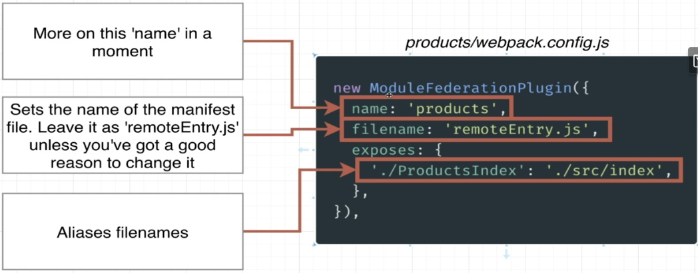

# Microfrontends with React
About this course. Build incredibly scalable apps with a microfronted architecture.

## Major Categories of Integration

### Build-Time Integration
#### Complile-Time Integration
*Before* container get loaded in the browser, it gets access.
Build-Time Integrations give the container access to a child's app source **before** it is loaded in the browser.

### Run-Time Integration
#### Client-Side Integration
Run-Time integrations give the container access to a child's app source **before** it is loaded in the browser.

### Server Integration

* Designate one app as the Host (CONTAINER) and one as the Remote (PRODUCTS).
* In the Remote, decide which modules (files) we want to make available to the project.
* Set Module Federation Plugin to *expose* those files.
* In the Host, decide which files we want to get from the Remote.


### Module Federation




### Understanding Configurations Options
**Host**

The property the first option property is `name`. The `name` is not being used whenever we are creating a host module.
Host is tryong to use some code from some other projects.
The property `remotes` controls how webpack is going to try to decide whether or not to load up that remote entry `JS` file.

Let's take look with `bootstrap.js` file.

```js
import 'products/ProductsIndex';
```

If webpack can't find a products dependency inside of node module directory. Then it's take a look at the `ModuleFederationPlugin` especifically `remotes` section. Inside this object it's going to see if there are any keys inside of here that have the word **products** eg:.
`products: 'products@http://localhost:8085/remoteEntry.js'`.

The word products in `boostrap.js` file matches up with the key products in the `remotes` property options.
Like this:



If we change the property option inside `remotes` we need to change in all files where we implement this module.




we can get an error `Field 'browser' doesn't contain a valid alias configuration resolve as module.` if we dont change the name module like this.



#### Webpack Configuration Module Federation - Host (Container)




**Remote**
 In the webpack config MF to **remote** we have the property `name: 'products'` this string value it should be the indentical in webpack config **host** that what need to macth up eg:.




if this `name: 'products'` is not identical inside host webpack config nothing is going to work as expected.

The property `filename: 'remoteEntry.js'` controls the name of the remote entry file. It recommend that ww just always place it as `remoteEntry.js`.
The property object `exposes` controls which modules or files inside of our products project that we are going to expose to the outside the world.
In this case, we are going to expose a module called  `ProductsIndex` if anyone tries to import something called `ProductsIndex` we want ot give them the `'./src/index'` file.



Webpack **host** is going to get that remoteEntry file inside there it's going to try to find something called `ProductsIndex`.

The reason that we have this kind of aliasing ability `'./ProductsIndex'` is beacause there might be some scenarios where the name of file inside of our products project might be kind of pnly meaningful in the context of product.
This another example when we have multiple file, alias help us write out the word `index` to choose exactly the names ans paths for these exported files.


#### Webpack Configuration Module Federation - Products

