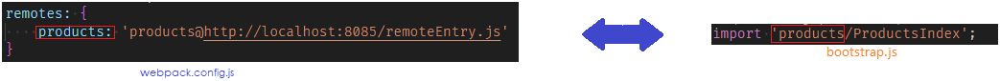

# Microfrontends with React
About this course. Build incredibly scalable apps with a microfronted architecture.

## Major Categories of Integration

### Build-Time Integration
#### Complile-Time Integration
*Before* container get loaded in the browser, it gets access.
Build-Time Integrations give the container access to a child's app source **before** it is loaded in the browser.

### Run-Time Integration
#### Client-Side Integration
Run-Time integrations give the container access to a child's app source **before** it is loaded in the browser.

### Server Integration

* Designate one app as the Host (CONTAINER) and one as the Remote (PRODUCTS).
* In the Remote, decide which modules (files) we want to make available to the project.
* Set Module Federation Plugin to *expose* those files.
* In the Host, decide which files we want to get from the Remote.

### Module Federation


### Understanding Configurations Options
**Host**

The property the first option property is `name`. The `name` is not being used whenever we are creating a host module.
Host is tryong to use some code from some other projects.
The property `remotes` controls how webpack is going to try to decide whether or not to load up that remote entry `JS` file.

Let's take look with `bootstrap.js` file.

```js
import 'products/ProductsIndex';
```

If webpack can't find a products dependency inside of node module directory. Then it's take a look at the `ModuleFederationPlugin` especifically `remotes` section. Inside this object it's going to see if there are any keys inside of here that have the word **products** eg:.
`products: 'products@http://localhost:8085/remoteEntry.js'`.

The word products in `boostrap.js` file matches up with the key products in the `remotes` property options.
Like this:



